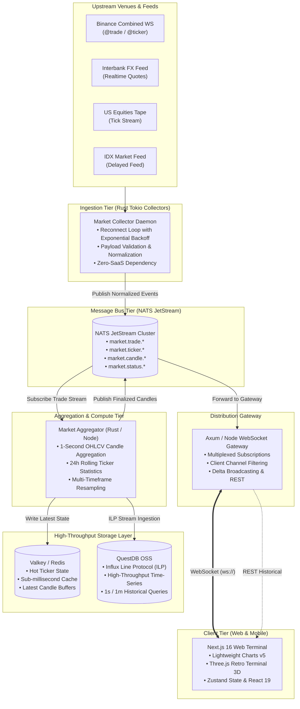

# Gorengan Index — Realtime Multi-Asset Market Terminal 📊⚡

<div align="center">

```text
  ____                                              ___           _           
 / ___| ___  _ __ ___ _ __   __ _  __ _ _ __       |_ _|_ __   __| | _____  __
| |  _ / _ \| '__/ _ \ '_ \ / _` |/ _` | '_ \ _____ | || '_ \ / _` |/ _ \ \/ /
| |_| | (_) | | |  __/ | | | (_| | (_| | | | |_____|| || | | | (_| |  __/>  < 
 \____|\___/|_|  \___|_| |_|\__, |\__,_|_| |_|     |___|_| |_|\__,_|\___/_/\_\
                            |___/                                             
```

**An institutional-grade, ultra-low-latency financial market terminal and 500-instrument time-series data platform.**

[](https://nextjs.org/)
[](https://react.dev/)
[](https://www.typescriptlang.org/)
[](https://www.rust-lang.org/)
[](https://tokio.rs/)
[](https://nats.io/)
[](https://questdb.io/)
[](https://valkey.io/)
[](https://tailwindcss.com/)
[](https://www.docker.com/)
[](https://kubernetes.io/)
[](LICENSE)

[Key Features](#-key-features) • [System Architecture](#-system-architecture--distributed-pipeline) • [Instrument Universe (500 Assets)](#-instrument-universe-500-assets) • [Installation & Quick Start](#-installation--quick-start) • [API & WebSocket Protocol](#-websocket-protocol--rest-api)

---

</div>

## 📑 Table of Contents
- [System Overview](#-system-overview)
- [User Interface & Visual Aesthetics](#-user-interface--visual-aesthetics)
- [Key Features](#-key-features)
- [Instrument Universe (500 Assets)](#-instrument-universe-500-assets)
- [System Architecture & Distributed Pipeline](#-system-architecture--distributed-pipeline)
  - [1. High-Level Topology](#1-high-level-topology)
  - [2. Event-Driven Data Pipeline](#2-event-driven-data-pipeline)
  - [3. Dual-Tier Storage Architecture](#3-dual-tier-storage-architecture)
  - [4. Single Source of Truth (SSOT) Auto-Sync Engine](#4-single-source-of-truth-ssot-auto-sync-engine)
- [Workspace & Monorepo Structure](#-workspace--monorepo-structure)
- [WebSocket Protocol & REST API](#-websocket-protocol--rest-api)
  - [WebSocket Interface](#1-websocket-interface-wslocalhost9000ws)
  - [REST API Endpoints](#2-rest-api-endpoints)
- [Installation & Quick Start](#-installation--quick-start)
  - [Option 1: Local Development (Fast & Self-Contained)](#option-1-local-development-fast--self-contained)
  - [Option 2: Full Docker Compose](#option-2-full-docker-compose)
  - [Option 3: Distributed High-Throughput Stack (Rust + NATS + QuestDB + Valkey)](#option-3-distributed-high-throughput-stack-rust--nats--questdb--valkey)
  - [Option 4: Production Kubernetes (GitOps)](#option-4-production-kubernetes-gitops)
- [Environment Configuration (.env)](#-environment-configuration-env)
- [Observability & Telemetry](#-observability--telemetry)
- [License](#-license)

---

## ⚡ System Overview

**Gorengan Index** is an institutional-grade, self-hosted real-time financial market terminal engineered for extreme performance, sub-second latency, and complete infrastructure sovereignty.

The platform continuously streams and charts **500 cross-asset financial instruments** (Cryptocurrencies, Foreign Exchange / Forex, Tokenized Commodities/Metals, US Blue-Chip Equities, and Indonesia Stock Exchange / IDX Equities) with candlestick updates down to **1-second resolution (1s OHLCV)**.

### Core Engineering Principles:
1. **Zero-SaaS-Cost Dependency**: Consumes direct exchange feeds natively (Binance WebSocket, Interbank FX rates, Consolidated Equities Tape) without paying for third-party subscription APIs or running into restrictive quota limits (CoinGecko, CoinMarketCap, TwelveData, Polygon, or Alpha Vantage).
2. **Sub-Second Streaming Pipeline**: Event-driven streaming architecture processing raw ticks, real-time candlestick aggregation, and instant WebSocket fanout.
3. **Dual Connection Modes**: Unauthenticated public preview with 5-second sampling to conserve bandwidth, paired with an authenticated **Pro Stream** mode delivering zero-throttling live ticks.
4. **Resilient Microservices Topology**: Strict separation of concerns between feed ingestion daemons, message bus routing, time-series aggregation, fast cache, and edge gateway distribution.
5. **Single Source of Truth (SSOT)**: Unified instrument catalog shared between TypeScript (`@gorengan/shared`) and Rust (`crates/market-domain`) via automated build-time compile embedding.

---

## 🎨 User Interface & Visual Aesthetics

Designed with a **Cyberpunk Retro-Terminal Aesthetic**, Gorengan Index merges the ergonomic precision of modern financial workstations with vintage 1980s computing nostalgia:

```text
┌────────────────────────────────────────────────────────────────────────────────────────────────────────┐
│  LIVE TICKER TAPE:  BTC/USDT $96,420.50 ▲ +2.41%   EUR/USD 1.08420 ▼ -0.15%   ID:BBCA Rp10,250 ▲ +1.2% │
├────────────────────────────────────────────────────────────────────────────────────────────────────────┤
│ ┌─ WATCHLIST ─────────┐ ┌─ LIGHTWEIGHT CHARTS (1-SECOND RESOLUTION) ──────────────────┐ ┌─ INTEL ────┐ │
│ │ [Crypto] [FX] [IDX] │ │ BTC-USDT  $96,420.50  H: 96,800.00  L: 95,200.00  Vol: 24.2K │ │ MARKET     │ │
│ │                     │ │ ┌─────────────────────────────────────────────────────────┐ │ │ BREADTH:   │ │
│ │ • BTC-USDT  $96.4K  │ │ │                 ▲ (Green Candle)                        │ │ │ ▲ 312 Up   │ │
│ │ • ETH-USDT   $2.7K  │ │ │         ▲       █                                       │ │ │ ▼ 174 Down │ │
│ │ • SOL-USDT   $184   │ │ │         █   ▼   █                                       │ │ │ ─ 14 Flat  │ │
│ │ • USD/IDR  Rp16,420 │ │ │         █   █   █                                       │ │ │            │ │
│ │ • ID:BBCA  Rp10,250 │ │ │     ▲   █   █   █                                       │ │ │ SESSIONS:  │ │
│ │ • ID:BBRI   Rp5,150 │ │ │ ────█───█───█───█───────────────────────────────────────│ │ │ US: Closed │ │
│ │ • US:NVDA   $138.2  │ │ │ ▄▄█▄▄▄█▄▄█▄▄█▄▄█▄▄ (Volume Histogram)                  │ │ │ ID: Open   │ │
│ │ • US:AAPL   $224.5  │ │ └─────────────────────────────────────────────────────────┘ │ │ FX: 24/5   │ │
│ └─────────────────────┘ └─────────────────────────────────────────────────────────────┘ └────────────┘ │
├────────────────────────────────────────────────────────────────────────────────────────────────────────┤
│ ◄◄  SUB-SECOND INFINITE TICKER TAPE (PAUSE ON HOVER • HARDWARE-ACCELERATED TRANSLATE3D)             ►► │
└────────────────────────────────────────────────────────────────────────────────────────────────────────┘
```

- **Interactive Retro 3D Terminal Scene**: A vintage computer workstation rendered in-browser using Three.js WebGL canvas.
- **CRT Scanlines & Phosphor Glow**: Authentic CRT monitor scanline overlays with retro monospaced typography (`VT323` & `Press Start 2P`).
- **Dynamic Price Flash Engine**: Cells throughout the market tables and ticker tapes glow green (*flash-up*) or red (*flash-down*) on sub-second price delta events.
- **Continuous Bottom Sticky Ticker Tape**: Infinite running marquee animated via hardware-accelerated CSS `translate3d`, pause-on-hover, and `prefers-reduced-motion` compliance.
- **Glassmorphic Responsive Workspace**: Adaptive multi-column layouts for desktop, tablet, and smartphone viewports with instant mobile tab navigation.

---

## 🚀 Key Features

- **Real-Time Candlestick Charting**: High-performance interactive candlestick engine using TradingView Lightweight Charts v5 with timeframes: **1s (1 second)**, 1m, 5m, 15m, 1h, and 1d.
- **500-Instrument Universe Coverage**: Comprehensive tracking of Crypto, Foreign Exchange, Tokenized Metals, US Megacaps (S&P 500 / Nasdaq-100), and Indonesian Blue-Chips (LQ45 / IDX).
- **Market Breadth & Realtime Intelligence**:
  - Real-time advancing, declining, and unchanged asset counters.
  - 24-hour rolling volume and high/low metrics.
  - Live market news feed with sentiment classification.
- **Session State & Trading Hours Awareness**:
  - Real-time awareness of market trading sessions (New York Stock Exchange, IDX Jakarta session, and 24/5 Interbank FX).
  - Configurable candlestick price basis (*Trade Price* for equities/crypto vs *Mid Price* for bidirectional FX bid/ask quotes).
- **Enterprise Authentication & Session Guard**:
  - Google OAuth integration powered by NextAuth.js v5.
  - Route guard proxy separating public preview mode (5-second throttled) from verified Pro streaming (*zero-throttle*).
- **Self-Healing Connection Engine**:
  - Automatic reconnection algorithm featuring exponential backoff and randomized jitter.
  - Gap-detection and backfill engine ensuring continuous candlestick time-series integrity.

---

## 🌐 Instrument Universe (500 Assets)

The system manages 500 active, verified instruments categorized into 4 core asset classes:

| Asset Class | Symbols Count | Representative Assets | Symbol Canonical ID | Candle Price Basis | Upstream Provider |
|---|---|---|---|---|---|
| **Cryptocurrency** | **200** | BTC, ETH, SOL, BNB, XRP, DOGE, ADA, AVAX, LINK, SUI, NEAR, PEPE, SHIB, WIF, BONK, JUP, RENDER, INJ, AAVE, TIA, FET, TAO, PENDLE, ONDO, FLOKI, etc. | `BTC-USDT`, `SOL-USDT`, `WIF-USDT` | Trade Price | Binance Native WebSocket |
| **Foreign Exchange (Forex)** | **40** | EUR/USD, GBP/USD, USD/JPY, AUD/USD, USD/CAD, USD/CHF, NZD/USD, USD/IDR, EUR/IDR, SGD/IDR, EUR/GBP, EUR/JPY, GBP/JPY, AUD/JPY, USD/SGD, etc. | `EUR-USD`, `USD-IDR`, `GBP-JPY` | Mid Price (Bid/Ask) | Interbank FX Feed / Yahoo Realtime |
| **Tokenized Metals** | **2** | Paxos Gold (PAXG), Tether Gold (XAUT) | `PAXG-USDT`, `XAUT-USDT` | Trade Price | Binance Spot Stream |
| **US Equities** | **120** | Apple, Microsoft, NVIDIA, Amazon, Alphabet, Meta, Tesla, AMD, SPY, QQQ, Palantir, Netflix, Coinbase, MicroStrategy, Intel, Broadcom, TSMC, Eli Lilly, etc. | `US:AAPL`, `US:NVDA`, `US:MSFT` | Trade Price | US Consolidated Tape / Alpaca IEX |
| **Indonesian Equities (IDX)** | **138** | BBCA, BBRI, BMRI, BBNI, TLKM, ASII, ANTM, GOTO, ADRO, UNVR, ICBP, INDF, CPIN, KLBF, MDKA, INCO, BRPT, AMMN, BREN, PANI, PGAS, PTBA, etc. | `ID:BBCA`, `ID:BBRI`, `ID:BREN` | Trade Price | Indonesia Stock Exchange (IDX Feed) |

---

## 🏗️ System Architecture & Distributed Pipeline

Gorengan Index leverages a distributed microservices topology separating raw ingestion, message multiplexing, time-series rollups, persistent storage, and client distribution.

### 1. High-Level Topology



### 2. Event-Driven Data Pipeline

1. **Rust Collector Layer (`apps/collector`)**:
   - Built on the async **Tokio** runtime handling thousands of concurrent streams with microsecond dispatch times.
   - Normalizes raw incoming exchange payloads into strongly-typed `MarketMessage` schemas.
   - Publishes verified events directly to NATS JetStream.

2. **NATS JetStream Message Bus**:
   - High-throughput decoupling buffer between ingestion daemons and downstream consumers.
   - Eliminates head-of-line blocking and guarantees zero message loss during client connection surges.

3. **Candle Aggregator (`apps/aggregator` & `apps/market-server`)**:
   - Groups continuous raw trade ticks into discrete 1-second OHLCV buckets.
   - Broadcasts sub-second candle updates (`candle:update`) and finalizes buckets (`candle:finalized`) precisely at second boundaries.
   - Continuously computes rolling 24-hour statistics: high, low, volume, and percentage deltas.

4. **Distribution Gateway (`apps/gateway` & `apps/market-server`)**:
   - Manages thousands of simultaneous browser WebSocket connections.
   - Channel-based multiplexing: clients only receive updates for actively viewed instruments or watchlist symbols.

### 3. Dual-Tier Storage Architecture

- **Hot Cache (Valkey / Redis)**:
  - Stores instantaneous ticker state for all 500 symbols.
  - Sub-millisecond read latency ensuring instantaneous render on initial terminal connection.
- **Time-Series Database (QuestDB OSS)**:
  - Columnar time-series storage optimized specifically for financial data.
  - Influx Line Protocol (ILP) streaming ingestion handling thousands of candles per second with high disk compression.

### 4. Single Source of Truth (SSOT) Auto-Sync Engine

To avoid maintaining thousands of duplicate lines of code across TypeScript and Rust:
- **Rust Compile-Time Embedding**: [`crates/market-domain/src/instrument.rs`](crates/market-domain/src/instrument.rs) embeds the universe JSON directly via `include_str!("instruments.json")` and deserializes once via `LazyLock`. The Rust code was shrunk from **7,600+ lines to just 128 lines**.
- **Dynamic Config**: [`crates/config/src/lib.rs`](crates/config/src/lib.rs) derives its universe directly from `market_domain::Instrument::default_universe()`.
- **One-Command Synchronization**: Running `pnpm sync:instruments` (or `pnpm dev`) automatically:
  1. Compiles `@gorengan/shared` TypeScript definitions.
  2. Extracts and regenerates `crates/market-domain/src/instruments.json`.
  3. Executes `cargo test -p market-domain` to guarantee backend integrity.

---

## 📁 Workspace & Monorepo Structure

```text
gorengan-index/
├── apps/
│   ├── web/                        # Next.js 16 Web Terminal (React 19, Tailwind v4, Zustand)
│   │   ├── src/
│   │   │   ├── app/                # App Router: Landing (/), Terminal (/terminal), Login (/login)
│   │   │   ├── components/         # Primitives, UI Cards, Three.js 3D Retro Terminal
│   │   │   ├── features/           # Vertical Slice Feature Architecture:
│   │   │   │   ├── auth/           # NextAuth v5 session, Google OAuth & route guards
│   │   │   │   ├── chart/          # Lightweight Charts v5 Canvas & Timeframe Selector
│   │   │   │   ├── markets/        # Market Overview, Breadth, Stats, & Sticky Ticker Tape
│   │   │   │   ├── forex/          # FX pip calculations, formatters & session logic
│   │   │   │   ├── equities/       # US & IDX session state & market hours logic
│   │   │   │   ├── news/           # Live Market News Feed & sentiment tagger
│   │   │   │   └── watchlist/      # Watchlist sidebar & asset categorization
│   │   │   ├── hooks/              # Custom React Hooks (useTerminalWebSocket, etc.)
│   │   │   ├── stores/             # Zustand Reactive Stores (marketStore, watchlistStore)
│   │   │   └── utils/              # Pure utility functions & financial formatters
│   │   └── Dockerfile              # Multi-stage production build for Web
│   │
│   ├── market-server/              # Standalone Market Server (Node.js/TypeScript)
│   │   ├── src/
│   │   │   ├── market/             # 1s Candle Engine & in-memory state cache
│   │   │   ├── persistence/        # QuestDB client & candle repository
│   │   │   ├── providers/          # Binance native WebSocket client & Yahoo Fallback
│   │   │   ├── transport/          # HTTP REST server & WebSocket Gateway
│   │   │   └── jobs/               # Gap backfill & 24h retention pruning
│   │   └── Dockerfile              # Production Dockerfile for market-server
│   │
│   ├── collector/                  # High-Performance Rust Feed Collector (Tokio)
│   │   └── src/main.rs             # Native exchange WebSocket multiplexer & normalizer
│   │
│   ├── aggregator/                 # High-Performance Rust Candlestick Aggregator
│   │   └── src/main.rs             # 1-second candle rollup engine
│   │
│   └── gateway/                    # High-Performance Rust Axum WebSocket Gateway
│       └── src/main.rs             # High-concurrency client multiplexer
│
├── crates/                         # Shared Rust Workspace Crates
│   ├── market-domain/              # Domain entities: Instrument, Candle, Ticker, Quote
│   │   ├── src/instruments.json    # Canonical 500-instrument universe embedded at compile time
│   │   └── src/instrument.rs       # Streamlined 128-line instrument definitions
│   ├── market-protocol/            # Wire protocol schemas & NATS subject definitions
│   └── config/                     # Configuration loader from environment & files
│
├── packages/                       # Shared TypeScript Packages
│   └── shared/                     # Canonical 500-symbol universe, types, & WS protocol
│
├── scripts/
│   └── sync-instruments.mjs        # Automated TS <-> Rust universe synchronization
│
├── infra/                          # Distributed Infrastructure Configs
│   ├── docker-compose.yml          # Distributed Stack: NATS + QuestDB + Valkey + Prometheus + Grafana
│   └── prometheus.yml              # Telemetry scraper configuration
│
├── k8s/                            # Production Kubernetes Manifests (GitOps Ready)
│   ├── deployment.yaml             # Web frontend deployment & service
│   ├── backend.yaml                # Market-server backend deployment
│   ├── ingress.yaml                # TLS Ingress routing (Nginx / Traefik)
│   ├── nats.yaml                   # NATS JetStream cluster
│   ├── questdb.yaml                # QuestDB time-series storage
│   └── valkey.yaml                 # Valkey cache cluster
│
├── docker-compose.yml              # Root compose for web + market-server
├── Cargo.toml                      # Root Rust Workspace configuration
├── package.json                    # Root Node.js Workspace configuration
└── pnpm-workspace.yaml             # pnpm workspace configuration
```

---

## 📡 WebSocket Protocol & REST API

### 1. WebSocket Interface (`ws://localhost:9000/ws`)

Clients communicate asynchronously over JSON:

#### Client Subscriptions
Subscribe to instrument channels:
```json
{
  "op": "subscribe",
  "channels": [
    "ticker:BTC-USDT",
    "ticker:EUR-USD",
    "ticker:ID:BBCA",
    "candle:BTC-USDT:1s"
  ]
}
```

Unsubscribe from channels:
```json
{
  "op": "unsubscribe",
  "channels": [
    "candle:BTC-USDT:1s"
  ]
}
```

#### Server Broadcast Events
- **Ticker Update Event (`ticker`):**
  ```json
  {
    "type": "ticker",
    "data": {
      "symbol": "BTC-USDT",
      "price": 96420.50,
      "change24h": 2270.50,
      "changePercent24h": 2.41,
      "high24h": 96800.00,
      "low24h": 94150.00,
      "volume24h": 18452.84,
      "timestamp": 1774311950000
    }
  }
  ```

- **Candlestick Update Event (`candle:update` & `candle:finalized`):**
  ```json
  {
    "type": "candle",
    "data": {
      "symbol": "BTC-USDT",
      "time": 1774311950,
      "open": 96400.00,
      "high": 96435.00,
      "low": 96395.00,
      "close": 96420.50,
      "volume": 4.125,
      "isFinal": false
    }
  }
  ```

- **Provider Status Event (`status`):**
  ```json
  {
    "type": "status",
    "data": {
      "provider": "binance",
      "connected": true,
      "status": "healthy",
      "lastEventAt": 1774311950120,
      "subscribedSymbols": 200
    }
  }
  ```

### 2. REST API Endpoints

- `GET /api/symbols` — Returns the complete catalog of 500 supported market instruments.
- `GET /api/tickers` — Retrieves the latest price snapshots and 24h stats for all symbols.
- `GET /api/candles?symbol=BTC-USDT&resolution=1s&limit=300` — Fetches historical OHLCV candles.
- `GET /api/status` — Network latency and upstream exchange feed health status.

---

## 🚀 Installation & Quick Start

### Prerequisites
- **Node.js**: v20+ or v22+
- **pnpm**: v9+ or v11+ (`npm install -g pnpm`)
- **Rust Toolchain** *(Optional for Rust backend services)*: v1.75+ (`curl --proto '=https' --tlsv1.2 -sSf https://sh.rustup.rs | sh`)
- **Docker & Docker Compose** *(Optional)*

---

### Option 1: Local Development (Fast & Self-Contained)

Run the backend market server and Next.js frontend concurrently:

```bash
# 1. Clone repository
git clone https://github.com/jati251/gorengan-index.git
cd gorengan-index

# 2. Install workspace dependencies
pnpm install

# 3. Synchronize instruments and start dev servers
pnpm dev
```

Open **[http://localhost:3000](http://localhost:3000)** in your browser. Visit `/terminal` to access the interactive terminal.

---

### Option 2: Full Docker Compose

Run production web and market-server containers with a single command:

```bash
docker-compose up -d --build
```

- Web UI: `http://localhost:3000`
- Market Server (API & WebSocket): `http://localhost:9000`

---

### Option 3: Distributed High-Throughput Stack (Rust + NATS + QuestDB + Valkey)

For benchmarking high-throughput microservices:

```bash
# 1. Start NATS, QuestDB, Valkey, Prometheus, and Grafana
docker-compose -f infra/docker-compose.yml up -d

# 2. Run Rust market collector
cargo run --release --bin collector

# 3. Run Rust candle aggregator
cargo run --release --bin aggregator

# 4. Run Rust WebSocket gateway
cargo run --release --bin gateway

# 5. Start the web frontend
pnpm --filter web dev
```

- **QuestDB Web Console**: `http://localhost:9000`
- **Grafana Monitoring**: `http://localhost:3001` (user: `admin`, pass: `admin`)
- **NATS Dashboard**: `http://localhost:8222`
- **Prometheus Metrics**: `http://localhost:9090`

---

### Option 4: Production Kubernetes (GitOps)

Deploy to your Kubernetes cluster using the manifests in `k8s/`:

```bash
kubectl apply -f k8s/nats.yaml
kubectl apply -f k8s/valkey.yaml
kubectl apply -f k8s/questdb.yaml
kubectl apply -f k8s/backend.yaml
kubectl apply -f k8s/deployment.yaml
kubectl apply -f k8s/ingress.yaml
```

---

## ⚙️ Environment Configuration (.env)

Create a `.env` file at the root of the project:

```env
# ==========================================
# Market Server Configuration
# ==========================================
PORT=9000
HOST=0.0.0.0
LOG_LEVEL=info
QUESTDB_HTTP_URL=http://localhost:9000
RETENTION_1M_DAYS=7

# ==========================================
# Web Client Configuration
# ==========================================
NEXT_PUBLIC_WS_URL=ws://localhost:9000/ws
MARKET_SERVER_INTERNAL_URL=http://localhost:9000/api

# ==========================================
# Authentication (NextAuth v5 & Google OAuth)
# ==========================================
AUTH_SECRET=your_auth_secret_random_key_here
NEXTAUTH_SECRET=your_auth_secret_random_key_here
NEXTAUTH_URL=http://localhost:3000
AUTH_TRUST_HOST=true
GOOGLE_CLIENT_ID=your_google_oauth_client_id.apps.googleusercontent.com
GOOGLE_CLIENT_SECRET=your_google_oauth_client_secret

# ==========================================
# Distributed Cluster Services (Optional)
# ==========================================
NATS_URL=nats://localhost:4222
VALKEY_URL=redis://localhost:6379
QUESTDB_ILP_URL=localhost:9009
```

---

## 📊 Observability & Telemetry

- **Structured Tracing**: Rust services utilize `tracing` and `tracing-subscriber` for structured JSON logs.
- **Prometheus Scrapes**: Exposes trade ingestion rates per second, candle aggregation durations, active WebSocket client counters, and reconnect backoffs.
- **Grafana Dashboards**: Pre-configured dashboard templates in `infra/` for monitoring memory, message queues, and upstream latency 24/7.

---

## 📜 License

Distributed under dual license: **MIT License** or **Apache License 2.0**. See `LICENSE` for details.

---

<div align="center">

**Gorengan Index 📊⚡** — *High-Performance Multi-Asset Market Data Terminal.*  
Built with precision by [Jati Suryo](https://github.com/jati251) and the Open Source Community.

</div>
