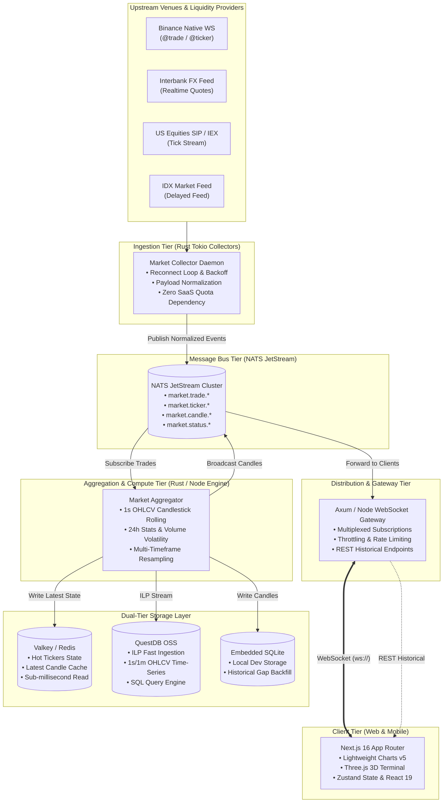

# Gorengan Index 🇮🇩🥟 — Realtime Market & Macroeconomic Terminal

<div align="center">

```
  ____                                              ___           _           
 / ___| ___  _ __ ___ _ __   __ _  __ _ _ __       |_ _|_ __   __| | _____  __
| |  _ / _ \| '__/ _ \ '_ \ / _` |/ _` | '_ \ _____ | || '_ \ / _` |/ _ \ \/ /
| |_| | (_) | | |  __/ | | | (_| | (_| | | | |_____|| || | | | (_| |  __/>  < 
 \____|\___/|_|  \___|_| |_|\__, |\__,_|_| |_|     |___|_| |_|\__,_|\___/_/\_\
                            |___/                                             
```

**An institutional-grade, low-latency financial market terminal and Indonesian purchasing power parity (PPP) engine.**

[](https://nextjs.org/)
[](https://react.dev/)
[](https://www.typescriptlang.org/)
[](https://www.rust-lang.org/)
[](https://tokio.rs/)
[](https://nats.io/)
[](https://questdb.io/)
[](https://valkey.io/)
[](https://tailwindcss.com/)
[](https://www.docker.com/)
[](https://kubernetes.io/)
[](LICENSE)

[Live Demo](https://gorengan-index.com) • [Arsitektur Sistem](#-arsitektur-sistem--distributed-pipeline) • [Universe Instrumen](#-universe-instrumen-72-assets) • [Panduan Instalasi](#-panduan-instalasi--quick-start) • [Dokumentasi API & WS](#-protokol-websocket--rest-api)

---

</div>

## 📑 Daftar Isi
- [Tentang Gorengan Index](#-tentang-gorengan-index)
- [Tampilan Antarmuka & Desain Visual](#-tampilan-antarmuka--desain-visual)
- [Fitur Utama](#-fitur-utama)
- [Universe Instrumen (72 Assets)](#-universe-instrumen-72-assets)
- [Arsitektur Sistem & Distributed Pipeline](#-arsitektur-sistem--distributed-pipeline)
  - [High-Level Topology](#1-high-level-topology)
  - [Data Pipeline & Event-Driven Flow](#2-data-pipeline--event-driven-flow)
  - [Dual-Tier Storage Architecture](#3-dual-tier-storage-architecture)
- [Formula Matematika & Engine Makroekonomi](#-formula-matematika--engine-makroekonomi)
- [Struktur Workspace & Monorepo](#-struktur-workspace--monorepo)
- [Protokol WebSocket & REST API](#-protokol-websocket--rest-api)
- [Panduan Instalasi & Quick Start](#-panduan-instalasi--quick-start)
  - [Opsi 1: Local Development (Paling Cepat)](#opsi-1-local-development-paling-cepat)
  - [Opsi 2: Docker Compose](#opsi-2-docker-compose)
  - [Opsi 3: Full Distributed Stack (NATS + QuestDB + Valkey)](#opsi-3-full-distributed-stack-nats--questdb--valkey)
  - [Opsi 4: Kubernetes Deployment (GitOps Ready)](#opsi-4-kubernetes-deployment-gitops-ready)
- [Konfigurasi Lingkungan (.env)](#-konfigurasi-lingkungan-env)
- [Observabilitas & Metrik](#-observabilitas--metrik)
- [Lisensi](#-lisensi)

---

## 💡 Tentang Gorengan Index

**Gorengan Index** adalah perpaduan unik antara kearifan lokal (*Indonesian cultural wisdom*) dan rekayasa perangkat lunak finansial tingkat institusional (*institutional-grade fintech engineering*).

Indikator makroekonomi konvensional seperti IHSG, Inflasi BPS, atau Nilai Tukar USD/IDR seringkali terasa abstrak bagi masyarakat akar rumput. Publik mungkin tidak langsung merasakan dampak fluktuasi kurs dari Rp16.200 ke Rp16.600 di pasar spot, namun mereka langsung merasakan kepanikan riil saat:
1. **Ukuran Bakwan seharga Rp3.000 menyusut menjadi seukuran korek api (*Shrinkflation*)**.
2. **Pedagang gorengan mulai menarik cabe rawit gratis dan menggantinya dengan sambal encer oplosan**.
3. **Minyak goreng curah melonjak hingga pedagang memangkas volume jualan harian**.

Untuk menjawab fenomena ini, **Gorengan Index** menghadirkan terminal pasar berkecepatan tinggi layaknya **Bloomberg Terminal / TradingView**, melacak **72 instrumen pasar lintas kelas aset** (Kripto, Forex, Komoditas Emas, Saham AS Wall Street, dan Saham Indonesia IDX), sekaligus menyuntikkan model parodi matematis **Standardisasi Internasional Gorengan (SIG)**.

---

## 🎨 Tampilan Antarmuka & Desain Visual

Antarmuka Gorengan Index dirancang dengan standar visual kelas atas (*Cyberpunk Retro-Terminal Aesthetics*) yang memadukan kesan retro 80-an dengan fungsionalitas modern:

```text
┌────────────────────────────────────────────────────────────────────────────────────────────────────────┐
│  LIVE TICKER TAPE:  BTC/USDT $96,420.50 ▲ +2.41%   EUR/USD 1.08420 ▼ -0.15%   ID:BBCA Rp10,250 ▲ +1.2% │
├────────────────────────────────────────────────────────────────────────────────────────────────────────┤
│ ┌─ WATCHLIST ─────────┐ ┌─ LIGHTWEIGHT CHARTS (1-SECOND RESOLUTION) ──────────────────┐ ┌─ INTEL ────┐ │
│ │ [Crypto] [FX] [IDX] │ │ BTC-USDT  $96,420.50  H: 96,800.00  L: 95,200.00  Vol: 24.2K │ │ MARKET     │ │
│ │                     │ │ ┌─────────────────────────────────────────────────────────┐ │ │ BREADTH:   │ │
│ │ • BTC-USDT  $96.4K  │ │ │                 ▲ (Green Candle)                        │ │ │ ▲ 48 Up    │ │
│ │ • ETH-USDT   $2.7K  │ │ │         ▲       █                                       │ │ │ ▼ 21 Down  │ │
│ │ • SOL-USDT   $184   │ │ │         █   ▼   █                                       │ │ │ ─ 3 Flat   │ │
│ │ • USD/IDR  Rp16,420 │ │ │         █   █   █                                       │ │ │            │ │
│ │ • ID:BBCA  Rp10,250 │ │ │     ▲   █   █   █                                       │ │ │ MACRO:     │ │
│ │ • ID:BBRI   Rp5,150 │ │ │ ────█───█───█───█───────────────────────────────────────│ │ │ UMP 2026:  │ │
│ │ • US:NVDA   $138.2  │ │ │ ▄▄█▄▄▄█▄▄█▄▄█▄▄█▄▄ (Volume Histogram)                  │ │ │ Rp5.2M/mo  │ │
│ │ • US:AAPL   $224.5  │ │ └─────────────────────────────────────────────────────────┘ │ │            │ │
│ └─────────────────────┘ └─────────────────────────────────────────────────────────────┘ └────────────┘ │
├────────────────────────────────────────────────────────────────────────────────────────────────────────┤
│ ◄◄  SUB-SECOND INFINITE TICKER TAPE (PAUSE ON HOVER • ACCELERATED HARDWARE CSS3 TRANSLATE3D)        ►► │
└────────────────────────────────────────────────────────────────────────────────────────────────────────┘
```

- **Retro 3D Terminal Scene**: Animasi terminal komputer vintage 3D interaktif yang dirender langsung di browser menggunakan Three.js WebGL canvas.
- **CRT Scanline & Glow Effects**: Lapisan filter CRT, phosphor scanlines, dan tipografi monospaced retro (`VT323` dan `Press Start 2P`).
- **Dynamic Price Flash Engine**: Sel harga pada tabel dan ticker tape akan otomatis berkilau hijau (*flash-up*) saat harga naik atau merah (*flash-down*) saat harga turun secara sub-detik.
- **Glassmorphic Control Surfaces**: Panel UI semitransparan dengan backdrop-filter blur, border neon subtil, dan responsivitas penuh dari layar mobile hingga monitor ultrawide 4K.

---

## ⚡ Fitur Utama

- **Sub-Second Real-Time Candlestick Charts**: Grafik interaktif berbasis TradingView Lightweight Charts v5 dengan timeframe hingga **1 detik (1s)**, 1m, 5m, 15m, 1h, dan 1d.
- **Zero-SaaS-Cost Upstream Pipeline**: Arsitektur backend mandiri (*self-hosted*) yang langsung mengonsumsi data *native public stream* tanpa bergantung pada layanan berbayar (CoinMarketCap, CoinGecko, TwelveData, atau Polygon).
- **Dual Connection Mode**:
  - *Public Preview Mode*: Pembaruan pasar otomatis disampel setiap 5 detik untuk menghemat bandwidth pengguna anonim.
  - *Authenticated Pro Mode*: Aliran data WebSocket berkecepatan tinggi tanpa hambatan (*zero-throttling*) setelah login via Google OAuth (NextAuth v5).
- **Macroeconomic & Shrinkflation Radar**: Pemetaan korelasi antara kurs USD/IDR, indeks harga minyak kelapa sawit (CPO), cuaca regional Jakarta (faktor hujan/permintaan), dan ukuran riil gorengan.
- **Market Breadth & Sentiment Intelligence**: Visualisasi rasio kenaikan/penurunan pasar (*Advancers vs Decliners*), volume leaders, dan kurasi berita pasar terkini secara *real-time*.
- **Sub-Second Bottom Sticky Ticker Tape**: Pita berjalan tak berujung (*infinite running marquee*) dengan animasi hardware-accelerated `translate3d`, pause on hover, dan deteksi preferensi aksesibilitas `prefers-reduced-motion`.

---

## 🌐 Universe Instrumen (72 Assets)

Sistem melacak 72 instrumen finansial aktif yang dinormalisasi ke dalam model format kanonikal:

| Kategori | Jumlah | Contoh Instrumen | Sumber Data (Provider) |
|---|---|---|---|
| **Cryptocurrency** | 20+ | `BTC-USDT`, `ETH-USDT`, `SOL-USDT`, `BNB-USDT`, `XRP-USDT`, `DOGE-USDT`, `ADA-USDT`, `SUI-USDT`, `AVAX-USDT`, `LINK-USDT` | Binance Combined WebSocket (`@trade`, `@ticker`) |
| **Forex & Mata Uang** | 16+ | `USD/IDR`, `EUR/USD`, `USD/JPY`, `GBP/USD`, `AUD/USD`, `USD/CAD`, `USD/CHF`, `EUR/GBP` | Interbank FX Stream / Yahoo Financial Feeds |
| **Tokenized Metals** | 2 | `PAXG-USDT` (Paxos Gold), `XAUT-USDT` (Tether Gold) | Binance Spot Market Feeds |
| **US Blue-Chip Equities** | 16+ | `US:AAPL`, `US:MSFT`, `US:NVDA`, `US:AMZN`, `US:GOOGL`, `US:META`, `US:TSLA`, `US:AMD`, `US:NFLX` | Alpaca IEX / Consolidated US Tape |
| **Indonesia Equities (IDX)** | 18+ | `ID:BBCA`, `ID:BBRI`, `ID:BMRI`, `ID:BBNI`, `ID:TLKM`, `ID:ASII`, `ID:ICBP`, `ID:GOTO`, `ID:AMMN` | Bursa Efek Indonesia (IDX Delayed Feed) |

---

## 🏗️ Arsitektur Sistem & Distributed Pipeline

Sistem dirancang dengan arsitektur microservices terdistribusi yang memisahkan layer *ingestion*, *aggregation*, *persistence*, dan *delivery*.

### 1. High-Level Topology



### 2. Data Pipeline & Event-Driven Flow

1. **Ingestion Layer (`apps/collector` - Rust)**:
   - Menjaga koneksi TCP/WebSocket presisten ke bursa global dengan *exponential backoff reconnect*.
   - Membaca jutaan byte JSON mentah per detik dan mem-parse secara aman menggunakan `serde_json` ke dalam tipe Rust kanonikal (`Instrument`, `TradeEvent`, `TickerEvent`).
   - Menerbitkan event ternormalisasi ke subjek NATS: `market.trade.<symbol>` dan `market.ticker.<symbol>`.

2. **Event Bus Layer (NATS JetStream)**:
   - Memisahkan (*decoupling*) feed collector dari agregator dan gateway.
   - Menyediakan retensi replay jangka pendek untuk mengeliminasi *data loss* saat terjadi spike jaringan atau rebalancing node.

3. **Aggregation Layer (`apps/aggregator` - Rust & `apps/market-server` - Node.js)**:
   - Menerima trade stream mentah dan menghitung pembentukan candle waktu nyata (*1-second bucket interval*).
   - Menghitung statistik bergulir (*rolling 24-hour high, low, volume, price change percentage*).
   - Memancarkan event `candle:update` saat candle sedang terbentuk dan `candle:finalized` saat bucket detik/menit ditutup.

4. **Dual-Tier Storage Architecture**:
   - **Valkey (Memory Cache)**: Menyimpan snapshot harga terakhir, status koneksi provider, dan ticker 24 jam dengan latensi baca < 1 milidetik.
   - **QuestDB OSS (Time-Series)**: Database berbasis *columnar* yang dioptimasi untuk metrik finansial berkecepatan tinggi. Mendukung jutaan baris per detik melalui Influx Line Protocol (ILP).
   - **SQLite**: Database lokal tanpa konfigurasi (*zero-setup*) untuk environment pengembang mandiri.

5. **Client Gateway & Frontend Delivery (`apps/web` & `apps/gateway`)**:
   - Mendukung multiplexing channel: klien hanya menerima data dari simbol yang sedang aktif dilihat atau ada di dalam watchlist.
   - Mekanisme **Smart Throttling**: Mengurangi konsumsi memori browser untuk pengguna umum dan mengalirkan data *unbounded 60fps* untuk pengguna terminal aktif.

---

## 🧮 Formula Matematika & Engine Makroekonomi

Selain data harga pasar murni, platform ini memiliki mesin algoritma makroekonomi parodi yang menghitung indikator berikut:

### 1. Gorengan Purchasing Power Parity (G-PPP)
Mengukur daya beli riil masyarakat berdasarkan ekuivalensi jumlah gorengan per satuan upah bulanan:

$$\text{Gorengan Net Worth} = \frac{\text{Gaji Bulanan}}{\text{Harga Regional Bakwan}}$$

*Kasta Finansial:*
- **> 3.000 Bakwan/bulan**: *Gorengan Whale / Konglomerat Tepung SCBD*
- **1.000 - 3.000 Bakwan/bulan**: *Gorengan Middle Class / Aman dari Maag*
- **< 1.000 Bakwan/bulan**: *Rentan Miskin Karbohidrat / Butuh Diversifikasi Portofolio*

### 2. Gorengan Shrinkflation Index (GSI)
Menghitung rasio penyusutan volume fisik gorengan yang dipicu oleh pelemahan nilai tukar Rupiah terhadap Dolar AS (kenaikan harga impor gandum):

$$\text{Shrinkage } (\%) = \max\left(50, \, 100 - \left(\frac{\text{Kurs IDR} - 15000}{100}\right)\right)$$

### 3. Weather Demand Shock Multiplier
Efek anomali cuaca terhadap elastisitas permintaan gorengan:
- **Kondisi Hujan (Rain / Storm)**: Koefisien permintaan $\times 3.0$ (*Extreme Bullish* $\rightarrow$ gorengan habis sebelum jam 5 sore).
- **Kondisi Panas Terik (Sunny / Dry)**: Koefisien permintaan $\times 0.7$ (*Bearish / Stagnant*).

---

## 📁 Struktur Workspace & Monorepo

Project ini dikelola sebagai monorepo multi-bahasa terpadu (**Rust Workspace + pnpm Workspace**):

```text
gorengan-index/
├── apps/
│   ├── web/                        # Next.js 16 Web Terminal (React 19, Tailwind v4, Zustand)
│   │   ├── src/
│   │   │   ├── app/                # Next.js App Router (Landing /, Terminal /terminal, Login /login)
│   │   │   ├── components/         # Shared UI Primitives & Three.js 3D Retro Terminal
│   │   │   ├── features/           # Vertical-Slice Feature Modules:
│   │   │   │   ├── auth/           # NextAuth v5 session, Google OAuth & route guard proxy
│   │   │   │   ├── chart/          # Lightweight Charts v5 Candlestick Engine
│   │   │   │   ├── markets/        # Market Overview, Breadth, Stats, & Sticky Ticker Tape
│   │   │   │   ├── forex/          # FX pip calculations, currency converters, formatter
│   │   │   │   ├── equities/       # US & IDX session state & market hours logic
│   │   │   │   ├── news/           # Live Market News Feed & sentiment tagger
│   │   │   │   └── watchlist/      # Watchlist sidebar & asset categorization
│   │   │   ├── hooks/              # Custom React Hooks (useTerminalWebSocket, etc.)
│   │   │   ├── stores/             # Global Zustand state stores (marketStore)
│   │   │   └── utils/              # Pure utility functions & financial formatters
│   │   └── Dockerfile              # Production multi-stage Docker build for Web
│   │
│   ├── market-server/              # Standalone Realtime Market Server (Node.js/TypeScript)
│   │   ├── src/
│   │   │   ├── market/             # 1s Candle Engine & in-memory state cache
│   │   │   ├── persistence/        # SQLite database & candle repository
│   │   │   ├── providers/          # Binance WebSocket native adapter
│   │   │   ├── transport/          # HTTP REST server & WebSocket Gateway
│   │   │   └── jobs/               # Gap backfill & 24h retention pruning
│   │   └── Dockerfile              # Dockerfile for market-server
│   │
│   ├── collector/                  # High-Performance Rust Feed Collector (Tokio)
│   │   └── src/main.rs             # Native exchange WebSocket multiplexer & normalizer
│   │
│   ├── aggregator/                 # High-Performance Rust Candlestick Aggregator
│   │   └── src/main.rs             # 1-second candle rollup engine
│   │
│   └── gateway/                    # High-Performance Rust Axum WebSocket Gateway
│       └── src/main.rs             # High-concurrency client multiplexer
│
├── crates/                         # Shared Rust Crates
│   ├── market-domain/              # Domain entities: Instrument, Candle, Ticker, Quote
│   ├── market-protocol/            # Wire protocol schemas & NATS subject definitions
│   └── config/                     # Configuration loader from environment & files
│
├── packages/                       # Shared TypeScript Packages
│   └── shared/                     # Canonical 72-symbol universe, types, & WS protocol
│
├── infra/                          # Infrastructure Configurations
│   ├── docker-compose.yml          # Distributed Stack: NATS + QuestDB + Valkey + Prometheus + Grafana
│   └── prometheus.yml              # Scrape configuration for telemetry metrics
│
├── k8s/                            # Kubernetes GitOps Manifests
│   ├── deployment.yaml             # Web frontend deployment & service
│   ├── backend.yaml                # Market-server backend deployment
│   ├── ingress.yaml                # TLS Ingress routing (Nginx / Traefik)
│   ├── nats.yaml                   # NATS JetStream StatefulSet
│   ├── questdb.yaml                # QuestDB persistence deployment
│   └── valkey.yaml                 # Valkey cache deployment
│
├── docker-compose.yml              # Root compose for web + market-server
├── Cargo.toml                      # Root Rust Workspace configuration
├── package.json                    # Root Node.js Workspace configuration
└── pnpm-workspace.yaml             # pnpm workspace configuration
```

---

## 📡 Protokol WebSocket & REST API

### 1. WebSocket Interface (`ws://localhost:9000/ws`)

Klien berkomunikasi melalui WebSocket JSON dua arah:

#### Client-to-Server Commands
- **Subscribe ke Simbol:**
  ```json
  {
    "type": "subscribe",
    "symbols": ["BTC-USDT", "USD/IDR", "ID:BBCA", "US:NVDA"]
  }
  ```
- **Unsubscribe dari Simbol:**
  ```json
  {
    "type": "unsubscribe",
    "symbols": ["DOGE-USDT"]
  }
  ```

#### Server-to-Client Events
- **Realtime Ticker Update (`ticker`):**
  ```json
  {
    "type": "ticker",
    "data": {
      "symbol": "BTC-USDT",
      "price": 96420.50,
      "change24h": 2270.50,
      "changePercent24h": 2.41,
      "high24h": 96800.00,
      "low24h": 94150.00,
      "volume24h": 18452.84,
      "timestamp": 1774311950000
    }
  }
  ```
- **Live Candlestick Tick (`candle:update` & `candle:finalized`):**
  ```json
  {
    "type": "candle",
    "data": {
      "symbol": "BTC-USDT",
      "time": 1774311950,
      "open": 96400.00,
      "high": 96435.00,
      "low": 96395.00,
      "close": 96420.50,
      "volume": 4.125,
      "isFinal": false
    }
  }
  ```

### 2. REST API Endpoints

- `GET /api/symbols`: Mengembalikan daftar seluruh 72 instrumen yang aktif.
- `GET /api/tickers`: Mengembalikan snapshot seluruh ticker harga 24 jam terakhir.
- `GET /api/candles?symbol=BTC-USDT&resolution=1s&limit=300`: Mengambil riwayat candle OHLCV historis.
- `GET /api/status`: Mengembalikan status latensi dan konektivitas upstream exchange.

---

## 🚀 Panduan Instalasi & Quick Start

### Prasyarat
- **Node.js**: v20+ atau v22+
- **pnpm**: v9+ (`npm install -g pnpm`)
- **Rust Toolchain** *(Opsional untuk Rust modules)*: v1.75+ (`curl --proto '=https' --tlsv1.2 -sSf https://sh.rustup.rs | sh`)
- **Docker & Docker Compose** *(Opsional untuk containerized run)*

---

### Opsi 1: Local Development (Paling Cepat)

Clone repository dan jalankan backend serta frontend secara bersamaan:

```bash
# 1. Clone repository
git clone https://github.com/jati251/gorengan-index.git
cd gorengan-index

# 2. Install seluruh dependensi monorepo
pnpm install

# 3. Setup environment file
cp .env.example .env # atau sesuaikan konfigurasi .env

# 4. Jalankan backend market-server (Port 9000)
pnpm --filter @gorengan/market-server dev

# 5. Pada tab terminal terpisah, jalankan web frontend (Port 3000)
pnpm --filter web dev
```

Buka **[http://localhost:3000](http://localhost:3000)** di browser Anda. Akses `/terminal` untuk memasuki antarmuka terminal trading lengkap.

---

### Opsi 2: Docker Compose

Jalankan seluruh stack (Web + Market Server + SQLite) dalam satu perintah:

```bash
docker-compose up -d --build
```

- Web UI: `http://localhost:3000`
- Market API & WS: `http://localhost:9000`

---

### Opsi 3: Full Distributed Stack (NATS + QuestDB + Valkey)

Untuk pengujian performa tinggi atau instalasi produksi mandiri:

```bash
# 1. Jalankan cluster infrastruktur (NATS, QuestDB, Valkey, Prometheus, Grafana)
docker-compose -f infra/docker-compose.yml up -d

# 2. Build & jalankan Rust collector daemon
cargo run --release --bin collector

# 3. Build & jalankan Rust aggregator
cargo run --release --bin aggregator

# 4. Jalankan frontend Next.js
pnpm --filter web dev
```

- **QuestDB Web Console**: `http://localhost:9000`
- **Grafana Dashboard**: `http://localhost:3001` (user: `admin`, pass: `admin`)
- **NATS Dashboard**: `http://localhost:8222`
- **Prometheus Metrics**: `http://localhost:9090`

---

### Opsi 4: Kubernetes Deployment (GitOps Ready)

Manifest Kubernetes produksi telah tersedia di folder `/k8s`:

```bash
# Deploy NATS, QuestDB, Valkey, backend, dan frontend ke klaster K8s
kubectl apply -f k8s/nats.yaml
kubectl apply -f k8s/valkey.yaml
kubectl apply -f k8s/questdb.yaml
kubectl apply -f k8s/backend.yaml
kubectl apply -f k8s/deployment.yaml
kubectl apply -f k8s/ingress.yaml
```

---

## ⚙️ Konfigurasi Lingkungan (.env)

Buat file `.env` di root direktori dengan parameter berikut:

```env
# ==========================================
# Market Server Configuration
# ==========================================
PORT=9000
HOST=0.0.0.0
LOG_LEVEL=info
SQLITE_PATH=./data/market.sqlite
RETENTION_1M_DAYS=7

# ==========================================
# Web Frontend Configuration
# ==========================================
NEXT_PUBLIC_WS_URL=ws://localhost:9000/ws
MARKET_SERVER_INTERNAL_URL=http://localhost:9000/api

# ==========================================
# Authentication (NextAuth v5 & Google OAuth)
# ==========================================
AUTH_SECRET=your_super_secret_auth_key_here
NEXTAUTH_SECRET=your_super_secret_auth_key_here
NEXTAUTH_URL=http://localhost:3000
AUTH_TRUST_HOST=true
GOOGLE_CLIENT_ID=your_google_client_id.apps.googleusercontent.com
GOOGLE_CLIENT_SECRET=your_google_client_secret

# ==========================================
# High-Scale Distributed Bus (Opsional)
# ==========================================
NATS_URL=nats://localhost:4222
VALKEY_URL=redis://localhost:6379
QUESTDB_ILP_URL=localhost:9009
```

---

## 📊 Observabilitas & Metrik

Platform ini dilengkapi instrumentasi telemetri terintegrasi:
- **Rust Services**: Menggunakan library `tracing` dan `tracing-subscriber` dengan output JSON terstruktur.
- **Prometheus Scrapes**: Mengekspos metrik throughput trade per detik, latensi pengolahan candle, jumlah klien WebSocket terhubung, dan frekuensi rekoneksi feed.
- **Grafana Dashboards**: Template dashboard visual di `/infra/grafana` untuk memantau kesehatan server 24/7.

---

## 📜 Lisensi

Didistribusikan di bawah lisensi ganda: **MIT License** atau **Apache License 2.0**. Lihat file `LICENSE` untuk informasi lebih lanjut.

---

<div align="center">

**Gorengan Index 🇮🇩🥟** — *Mengukur Kekayaan Bangsa Melalui Tepung, Minyak, dan Bawang.*  
Built with passion by [Jati Suryo](https://github.com/jati251) and the Open Source Community.

</div>
