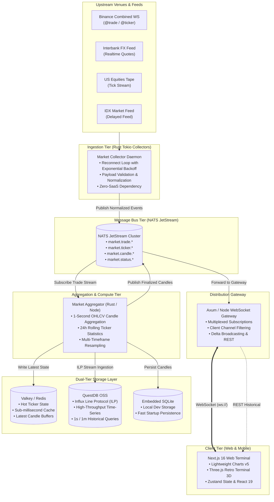

# Gorengan Index — Realtime Multi-Asset Market Terminal 📊⚡

<div align="center">

```text
  ____                                              ___           _           
 / ___| ___  _ __ ___ _ __   __ _  __ _ _ __       |_ _|_ __   __| | _____  __
| |  _ / _ \| '__/ _ \ '_ \ / _` |/ _` | '_ \ _____ | || '_ \ / _` |/ _ \ \/ /
| |_| | (_) | | |  __/ | | | (_| | (_| | | | |_____|| || | | | (_| |  __/>  < 
 \____|\___/|_|  \___|_| |_|\__, |\__,_|_| |_|     |___|_| |_|\__,_|\___/_/\_\
                            |___/                                             
```

**An institutional-grade, low-latency financial market terminal and multi-asset time-series data platform.**

[](https://nextjs.org/)
[](https://react.dev/)
[](https://www.typescriptlang.org/)
[](https://www.rust-lang.org/)
[](https://tokio.rs/)
[](https://nats.io/)
[](https://questdb.io/)
[](https://valkey.io/)
[](https://tailwindcss.com/)
[](https://www.docker.com/)
[](https://kubernetes.io/)
[](LICENSE)

[Fitur Utama](#-fitur-utama) • [Arsitektur Sistem](#-arsitektur-sistem--distributed-pipeline) • [Universe Instrumen](#-universe-instrumen-72-assets) • [Panduan Instalasi](#-panduan-instalasi--quick-start) • [Dokumentasi API & WS](#-protokol-websocket--rest-api)

---

</div>

## 📑 Daftar Isi
- [Ringkasan Sistem](#-ringkasan-sistem)
- [Tampilan Antarmuka & Desain Visual](#-tampilan-antarmuka--desain-visual)
- [Fitur Utama](#-fitur-utama)
- [Universe Instrumen (72 Assets)](#-universe-instrumen-72-assets)
- [Arsitektur Sistem & Distributed Pipeline](#-arsitektur-sistem--distributed-pipeline)
  - [1. High-Level Topology](#1-high-level-topology)
  - [2. Event-Driven Data Pipeline](#2-event-driven-data-pipeline)
  - [3. Dual-Tier Storage Architecture](#3-dual-tier-storage-architecture)
- [Struktur Workspace & Monorepo](#-struktur-workspace--monorepo)
- [Protokol WebSocket & REST API](#-protokol-websocket--rest-api)
  - [WebSocket Interface](#1-websocket-interface-wslocalhost9000ws)
  - [REST API Endpoints](#2-rest-api-endpoints)
- [Panduan Instalasi & Quick Start](#-panduan-instalasi--quick-start)
  - [Opsi 1: Local Development (Cepat & Mandiri)](#opsi-1-local-development-cepat--mandiri)
  - [Opsi 2: Full Docker Compose](#opsi-2-full-docker-compose)
  - [Opsi 3: Distributed High-Throughput Stack (Rust + NATS + QuestDB + Valkey)](#opsi-3-distributed-high-throughput-stack-rust--nats--questdb--valkey)
  - [Opsi 4: Production Kubernetes (GitOps)](#opsi-4-production-kubernetes-gitops)
- [Konfigurasi Lingkungan (.env)](#-konfigurasi-lingkungan-env)
- [Observabilitas & Telemetri](#-observabilitas--telemetri)
- [Lisensi](#-lisensi)

---

## ⚡ Ringkasan Sistem

**Gorengan Index** adalah platform terminal pasar finansial *real-time* berskala institusional yang dirancang untuk performa tinggi, latensi sub-detik, dan kemandirian infrastruktur (*self-hosted*). 

Sistem ini melacak **72 instrumen finansial lintas kelas aset** (Cryptocurrency, Foreign Exchange / Forex, Tokenized Commodities/Metals, US Blue-Chip Equities, dan Saham Bursa Efek Indonesia / IDX) dengan pembaruan grafik hingga resolusi **1 detik (1-second OHLCV)**.

### Prinsip Desain:
1. **Zero-SaaS-Cost Dependency**: Mengonsumsi langsung umpan data pasar (*native exchange feeds*) tanpa bergantung pada produk SaaS berbayar atau kuota bulanan berbatas (seperti CoinGecko, CoinMarketCap, TwelveData, Polygon, atau Alpha Vantage).
2. **Sub-Second Streaming Pipeline**: Arsitektur *event-driven* yang memproses setiap tick transaksi, agregasi candlestick, dan penyiaran WebSocket secara efisien.
3. **Dual Connection Mode**: Mode publik dengan sampling 5 detik untuk menghemat bandwidth anonim, serta mode terotentikasi (*Pro Stream*) dengan pembaruan instan tanpa pembatasan (*unthrottled live streaming*).
4. **Resilient Microservices Topology**: Menggunakan pemisahan tanggung jawab yang ketat antara *feed collectors*, *message bus*, *time-series aggregators*, *storage*, dan *gateway delivery*.

---

## 🎨 Tampilan Antarmuka & Desain Visual

Antarmuka Gorengan Index dirancang dengan standar estetika profesional (*Cyberpunk Retro-Terminal Aesthetics*) yang menggabungkan presisi terminal keuangan modern dengan sentuhan visual retro 80-an:

```text
┌────────────────────────────────────────────────────────────────────────────────────────────────────────┐
│  LIVE TICKER TAPE:  BTC/USDT $96,420.50 ▲ +2.41%   EUR/USD 1.08420 ▼ -0.15%   ID:BBCA Rp10,250 ▲ +1.2% │
├────────────────────────────────────────────────────────────────────────────────────────────────────────┤
│ ┌─ WATCHLIST ─────────┐ ┌─ LIGHTWEIGHT CHARTS (1-SECOND RESOLUTION) ──────────────────┐ ┌─ INTEL ────┐ │
│ │ [Crypto] [FX] [IDX] │ │ BTC-USDT  $96,420.50  H: 96,800.00  L: 95,200.00  Vol: 24.2K │ │ MARKET     │ │
│ │                     │ │ ┌─────────────────────────────────────────────────────────┐ │ │ BREADTH:   │ │
│ │ • BTC-USDT  $96.4K  │ │ │                 ▲ (Green Candle)                        │ │ │ ▲ 48 Up    │ │
│ │ • ETH-USDT   $2.7K  │ │ │         ▲       █                                       │ │ │ ▼ 21 Down  │ │
│ │ • SOL-USDT   $184   │ │ │         █   ▼   █                                       │ │ │ ─ 3 Flat   │ │
│ │ • USD/IDR  Rp16,420 │ │ │         █   █   █                                       │ │ │            │ │
│ │ • ID:BBCA  Rp10,250 │ │ │     ▲   █   █   █                                       │ │ │ SESSIONS:  │ │
│ │ • ID:BBRI   Rp5,150 │ │ │ ────█───█───█───█───────────────────────────────────────│ │ │ US: Closed │ │
│ │ • US:NVDA   $138.2  │ │ │ ▄▄█▄▄▄█▄▄█▄▄█▄▄█▄▄ (Volume Histogram)                  │ │ │ ID: Open   │ │
│ │ • US:AAPL   $224.5  │ │ └─────────────────────────────────────────────────────────┘ │ │ FX: 24/5   │ │
│ └─────────────────────┘ └─────────────────────────────────────────────────────────────┘ └────────────┘ │
├────────────────────────────────────────────────────────────────────────────────────────────────────────┤
│ ◄◄  SUB-SECOND INFINITE TICKER TAPE (PAUSE ON HOVER • HARDWARE-ACCELERATED TRANSLATE3D)             ►► │
└────────────────────────────────────────────────────────────────────────────────────────────────────────┘
```

- **Retro 3D Terminal Scene**: Model terminal komputer vintage 3D interaktif yang dirender langsung di browser menggunakan Three.js WebGL canvas.
- **CRT Scanline & Phosphor Glow**: Lapisan scanlines CRT otentik dengan tipografi monospaced retro (`VT323` dan `Press Start 2P`).
- **Dynamic Price Flash Engine**: Seluruh sel harga pada tabel pasar dan ticker tape otomatis berpendar hijau (*flash-up*) saat harga naik atau merah (*flash-down*) saat harga turun secara sub-detik.
- **Continuous Sticky Bottom Ticker Tape**: Pita harga berjalan tak berujung (*infinite running marquee*) dengan animasi hardware-accelerated CSS `translate3d`, pause on hover, dan deteksi preferensi aksesibilitas `prefers-reduced-motion`.
- **Glassmorphic Responsive Workspace**: Tata letak multi-kolom adaptif untuk desktop, tablet, dan smartphone dengan navigasi tab mobile yang intuitif.

---

## 🚀 Fitur Utama

- **Real-Time Candlestick Charting**: Visualisasi candlestick interaktif berkecepatan tinggi menggunakan TradingView Lightweight Charts v5 dengan timeframe **1 detik (1s)**, 1m, 5m, 15m, 1h, dan 1d.
- **Multi-Asset Universe Coverage**: 72 instrumen mencakup Kripto, Forex mayor/minor, Emas tokenisasi, Saham AS (S&P 500 & Nasdaq-100), serta Saham Indonesia (LQ45 & Blue Chip IDX).
- **Market Breadth & Realtime Intelligence**:
  - Pelacak rasio kenaikan/penurunan pasar (*Advancers, Decliners, Unchanged*).
  - Statistik volume harian dan volatilitas harga 24 jam.
  - Aliran berita pasar terkini (*Live News Feed*) dengan klasifikasi sentimen instan.
- **Session State & Trading Hours Awareness**:
  - Deteksi jam buka/tutup bursa (New York Session untuk saham AS, Jakarta Session untuk IDX, dan Interbank 24/5 untuk Forex).
  - Penyesuaian basis harga candle (*Trade Price* untuk saham/kripto vs *Mid Price* untuk kuotasi FX bid/ask).
- **Enterprise Authentication & Session Guard**:
  - Integrasi Google OAuth melalui NextAuth.js v5 (beta).
  - Route guard proxy dan pemisahan otomatis antara akses preview publik (disampel tiap 5 detik) dan koneksi WebSocket stream penuh (*zero-throttling*).
- **Self-Healing Connection Engine**:
  - Mekanisme *automatic reconnect* dengan *exponential backoff* dan jitter.
  - Deteksi *gap sequence* dan *historical backfill* otomatis untuk menjamin integritas data candle.

---

## 🌐 Universe Instrumen (72 Assets)

Platform melacak 72 instrumen pasar terverifikasi dengan data kanonikal:

| Kelas Aset | Total Simbol | Simbol Contoh | Format Simbol | Basis Harga Candle | Provider Asal |
|---|---|---|---|---|---|
| **Cryptocurrency** | 20 | Bitcoin, Ethereum, Solana, BNB, XRP, Dogecoin, Cardano, Sui, Avalanche, Chainlink | `BTC-USDT`, `ETH-USDT`, `SOL-USDT` | Trade Price | Binance Native WebSocket |
| **Foreign Exchange (Forex)** | 16 | USD/IDR, EUR/USD, USD/JPY, GBP/USD, AUD/USD, USD/CAD, USD/CHF, EUR/GBP, EUR/JPY, GBP/JPY | `USD/IDR`, `EUR/USD`, `USD/JPY` | Mid Price (Bid/Ask) | Interbank FX Feed / Yahoo Finance |
| **Tokenized Metals** | 2 | Paxos Gold, Tether Gold | `PAXG-USDT`, `XAUT-USDT` | Trade Price | Binance Spot Stream |
| **US Equities** | 16 | Apple, Microsoft, NVIDIA, Amazon, Alphabet, Meta, Tesla, AMD, Netflix, Intel | `US:AAPL`, `US:NVDA`, `US:MSFT` | Trade Price | US Consolidated Tape / Alpaca IEX |
| **Indonesian Equities (IDX)** | 18 | Bank Central Asia, Bank Rakyat Indonesia, Bank Mandiri, Telkom, Astra, Indofood, GoTo, Amman Mineral | `ID:BBCA`, `ID:BBRI`, `ID:GOTO` | Trade Price | Bursa Efek Indonesia (IDX Delayed Feed) |

---

## 🏗️ Arsitektur Sistem & Distributed Pipeline

Sistem dibangun dengan arsitektur microservices terdistribusi yang memisahkan ingestion, message routing, aggregasi data waktu, penyimpanan persisten, dan distribusi ke browser.

### 1. High-Level Topology



### 2. Event-Driven Data Pipeline

1. **Rust Collector Layer (`apps/collector`)**:
   - Berjalan pada runtime *Tokio* dengan kemampuan concurrency ribuan stream per thread.
   - Mengonsumsi WebSocket bursa secara paralel, memvalidasi urutan sequence event, dan menormalisasi payload JSON mentah ke tipe kanonikal `MarketMessage`.
   - Menerbitkan event ke NATS JetStream dengan overhead memori minimal.

2. **NATS JetStream Bus**:
   - Berfungsi sebagai *decoupling buffer* berkinerja tinggi antara ingestion dan sistem hilir (*downstream*).
   - Menghilangkan *head-of-line blocking* dan memastikan zero-data-loss bahkan ketika gateway klien mengalami lonjakan koneksi.

3. **Candle Aggregator (`apps/aggregator` & `apps/market-server`)**:
   - Mengelompokkan raw trade ticks ke dalam bucket waktu 1 detik (*1s OHLCV*).
   - Memperbarui candle aktif secara sub-detik (`candle:update`) dan memfinalisasi bucket saat batas detik terlewati (`candle:finalized`).
   - Menghitung statistik harga 24 jam bergulir: *high, low, volume, price change percentage*.

4. **Distribution Gateway (`apps/gateway` & `apps/market-server`)**:
   - Mengelola koneksi ribuan browser via WebSocket.
   - Menyediakan fitur *subscription filtering*: klien hanya menerima update dari instrumen yang sedang dibuka atau berada di daftar pantauan (*watchlist*).

### 3. Dual-Tier Storage Architecture

- **Hot Cache (Valkey / Redis)**:
  - Menyimpan status ticker terkini dari seluruh 72 simbol.
  - Latensi baca sub-milidetik untuk rendering instan saat pengguna pertama kali membuka terminal.
- **Time-Series Database (QuestDB OSS)**:
  - Menggunakan *columnar storage* yang dioptimasi khusus untuk data keuangan.
  - Ingestion ribuan candle per detik melalui Influx Line Protocol (ILP) dengan efisiensi kompresi disk tinggi.
- **Embedded Engine (SQLite)**:
  - Solusi penyimpanan *zero-configuration* untuk lingkungan pengembangan lokal dan deployment single-container.

---

## 📁 Struktur Workspace & Monorepo

```text
gorengan-index/
├── apps/
│   ├── web/                        # Next.js 16 Web Terminal (React 19, Tailwind v4, Zustand)
│   │   ├── src/
│   │   │   ├── app/                # App Router: Landing (/), Terminal (/terminal), Login (/login)
│   │   │   ├── components/         # Primitives, UI Cards, Three.js 3D Retro Terminal
│   │   │   ├── features/           # Vertical Slice Feature Architecture:
│   │   │   │   ├── auth/           # NextAuth v5 session, Google OAuth & route guards
│   │   │   │   ├── chart/          # Lightweight Charts v5 Canvas & Timeframe Selector
│   │   │   │   ├── markets/        # Market Overview, Breadth, Stats, & Sticky Ticker Tape
│   │   │   │   ├── forex/          # FX pip calculations, formatters & session logic
│   │   │   │   ├── equities/       # US & IDX session state & market hours logic
│   │   │   │   ├── news/           # Live Market News Feed & sentiment tagger
│   │   │   │   └── watchlist/      # Watchlist sidebar & asset categorization
│   │   │   ├── hooks/              # Custom React Hooks (useTerminalWebSocket, etc.)
│   │   │   ├── stores/             # Zustand Reactive Stores (marketStore, watchlistStore)
│   │   │   └── utils/              # Pure utility functions & financial formatters
│   │   └── Dockerfile              # Multi-stage production build untuk Web
│   │
│   ├── market-server/              # Standalone Market Server (Node.js/TypeScript)
│   │   ├── src/
│   │   │   ├── market/             # 1s Candle Engine & in-memory state cache
│   │   │   ├── persistence/        # SQLite database & candle repository
│   │   │   ├── providers/          # Binance native WebSocket client
│   │   │   ├── transport/          # HTTP REST server & WebSocket Gateway
│   │   │   └── jobs/               # Gap backfill & 24h retention pruning
│   │   └── Dockerfile              # Production Dockerfile untuk market-server
│   │
│   ├── collector/                  # High-Performance Rust Feed Collector (Tokio)
│   │   └── src/main.rs             # Native exchange WebSocket multiplexer & normalizer
│   │
│   ├── aggregator/                 # High-Performance Rust Candlestick Aggregator
│   │   └── src/main.rs             # 1-second candle rollup engine
│   │
│   └── gateway/                    # High-Performance Rust Axum WebSocket Gateway
│       └── src/main.rs             # High-concurrency client multiplexer
│
├── crates/                         # Shared Rust Workspace Crates
│   ├── market-domain/              # Domain entities: Instrument, Candle, Ticker, Quote
│   ├── market-protocol/            # Wire protocol schemas & NATS subject definitions
│   └── config/                     # Configuration loader from environment & files
│
├── packages/                       # Shared TypeScript Packages
│   └── shared/                     # Canonical 72-symbol universe, types, & WS protocol
│
├── infra/                          # Distributed Infrastructure Configs
│   ├── docker-compose.yml          # Distributed Stack: NATS + QuestDB + Valkey + Prometheus + Grafana
│   └── prometheus.yml              # Telemetry scraper configuration
│
├── k8s/                            # Production Kubernetes Manifests (GitOps Ready)
│   ├── deployment.yaml             # Web frontend deployment & service
│   ├── backend.yaml                # Market-server backend deployment
│   ├── ingress.yaml                # TLS Ingress routing (Nginx / Traefik)
│   ├── nats.yaml                   # NATS JetStream cluster
│   ├── questdb.yaml                # QuestDB time-series storage
│   └── valkey.yaml                 # Valkey cache cluster
│
├── docker-compose.yml              # Root compose for web + market-server
├── Cargo.toml                      # Root Rust Workspace configuration
├── package.json                    # Root Node.js Workspace configuration
└── pnpm-workspace.yaml             # pnpm workspace configuration
```

---

## 📡 Protokol WebSocket & REST API

### 1. WebSocket Interface (`ws://localhost:9000/ws`)

Klien berkomunikasi secara asinkron menggunakan format JSON:

#### Client Subscriptions
Kirim pesan subscribe untuk mendaftarkan channel instrumen:
```json
{
  "op": "subscribe",
  "channels": [
    "ticker:BTC-USDT",
    "ticker:USD/IDR",
    "ticker:ID:BBCA",
    "candle:BTC-USDT:1s"
  ]
}
```

Batalkan langganan channel:
```json
{
  "op": "unsubscribe",
  "channels": [
    "candle:BTC-USDT:1s"
  ]
}
```

#### Server Broadcast Events
- **Ticker Update Event (`ticker`):**
  ```json
  {
    "type": "ticker",
    "data": {
      "symbol": "BTC-USDT",
      "price": 96420.50,
      "change24h": 2270.50,
      "changePercent24h": 2.41,
      "high24h": 96800.00,
      "low24h": 94150.00,
      "volume24h": 18452.84,
      "timestamp": 1774311950000
    }
  }
  ```

- **Candlestick Update Event (`candle:update` & `candle:finalized`):**
  ```json
  {
    "type": "candle",
    "data": {
      "symbol": "BTC-USDT",
      "time": 1774311950,
      "open": 96400.00,
      "high": 96435.00,
      "low": 96395.00,
      "close": 96420.50,
      "volume": 4.125,
      "isFinal": false
    }
  }
  ```

- **Provider Status Event (`status`):**
  ```json
  {
    "type": "status",
    "data": {
      "provider": "binance",
      "connected": true,
      "status": "healthy",
      "lastEventAt": 1774311950120,
      "subscribedSymbols": 20
    }
  }
  ```

### 2. REST API Endpoints

- `GET /api/symbols` — Mengembalikan katalog 72 instrumen pasar yang didukung.
- `GET /api/tickers` — Mengambil snapshot harga dan statistik 24 jam seluruh instrumen.
- `GET /api/candles?symbol=BTC-USDT&resolution=1s&limit=300` — Mengambil riwayat candle OHLCV historis.
- `GET /api/status` — Status kesehatan koneksi feed bursa dan latensi jaringan.

---

## 🚀 Panduan Instalasi & Quick Start

### Prasyarat
- **Node.js**: v20+ atau v22+
- **pnpm**: v9+ (`npm install -g pnpm`)
- **Rust Toolchain** *(Opsional)*: v1.75+ (`curl --proto '=https' --tlsv1.2 -sSf https://sh.rustup.rs | sh`)
- **Docker & Docker Compose** *(Opsional)*

---

### Opsi 1: Local Development (Cepat & Mandiri)

Jalankan server backend dan web frontend secara lokal:

```bash
# 1. Clone repository
git clone https://github.com/jati251/gorengan-index.git
cd gorengan-index

# 2. Install dependensi pnpm workspace
pnpm install

# 3. Konfigurasi file lingkungan
cp .env.example .env

# 4. Jalankan market-server backend (Port 9000)
pnpm --filter @gorengan/market-server dev

# 5. Pada tab terminal terpisah, jalankan web frontend (Port 3000)
pnpm --filter web dev
```

Buka **[http://localhost:3000](http://localhost:3000)** di browser Anda. Kunjungi `/terminal` untuk mengakses terminal charting interaktif.

---

### Opsi 2: Full Docker Compose

Jalankan container produksi web dan backend dalam satu perintah:

```bash
docker-compose up -d --build
```

- Web UI: `http://localhost:3000`
- Market Server (API & WebSocket): `http://localhost:9000`

---

### Opsi 3: Distributed High-Throughput Stack (Rust + NATS + QuestDB + Valkey)

Untuk pengujian performa tinggi dengan arsitektur microservices terdistribusi:

```bash
# 1. Jalankan cluster NATS, QuestDB, Valkey, Prometheus, dan Grafana
docker-compose -f infra/docker-compose.yml up -d

# 2. Jalankan Rust market collector
cargo run --release --bin collector

# 3. Jalankan Rust candle aggregator
cargo run --release --bin aggregator

# 4. Jalankan Rust WebSocket gateway
cargo run --release --bin gateway

# 5. Jalankan web frontend
pnpm --filter web dev
```

- **QuestDB Web Console**: `http://localhost:9000`
- **Grafana Monitoring**: `http://localhost:3001` (user: `admin`, pass: `admin`)
- **NATS Dashboard**: `http://localhost:8222`
- **Prometheus Metrics**: `http://localhost:9090`

---

### Opsi 4: Production Kubernetes (GitOps)

Deploy ke klaster Kubernetes menggunakan manifest yang tersedia di direktori `k8s/`:

```bash
kubectl apply -f k8s/nats.yaml
kubectl apply -f k8s/valkey.yaml
kubectl apply -f k8s/questdb.yaml
kubectl apply -f k8s/backend.yaml
kubectl apply -f k8s/deployment.yaml
kubectl apply -f k8s/ingress.yaml
```

---

## ⚙️ Konfigurasi Lingkungan (.env)

Buat file `.env` pada root project:

```env
# ==========================================
# Market Server Configuration
# ==========================================
PORT=9000
HOST=0.0.0.0
LOG_LEVEL=info
SQLITE_PATH=./data/market.sqlite
RETENTION_1M_DAYS=7

# ==========================================
# Web Client Configuration
# ==========================================
NEXT_PUBLIC_WS_URL=ws://localhost:9000/ws
MARKET_SERVER_INTERNAL_URL=http://localhost:9000/api

# ==========================================
# Authentication (NextAuth v5 & Google OAuth)
# ==========================================
AUTH_SECRET=your_auth_secret_random_key_here
NEXTAUTH_SECRET=your_auth_secret_random_key_here
NEXTAUTH_URL=http://localhost:3000
AUTH_TRUST_HOST=true
GOOGLE_CLIENT_ID=your_google_oauth_client_id.apps.googleusercontent.com
GOOGLE_CLIENT_SECRET=your_google_oauth_client_secret

# ==========================================
# Distributed Cluster Services (Opsional)
# ==========================================
NATS_URL=nats://localhost:4222
VALKEY_URL=redis://localhost:6379
QUESTDB_ILP_URL=localhost:9009
```

---

## 📊 Observabilitas & Telemetri

Sistem dilengkapi dengan visibilitas telemetri tingkat tinggi:
- **Structured Tracing**: Layanan Rust menggunakan crate `tracing` dan `tracing-subscriber` dengan output log JSON terstruktur.
- **Prometheus Scrapes**: Mengumpulkan metrik throughput trade per detik, waktu agregasi per candle, jumlah koneksi aktif WebSocket, dan counter rekoneksi.
- **Grafana Dashboards**: Template monitoring di folder `infra/` untuk mengawasi penggunaan memori, antrean pesan, dan kesehatan server 24/7.

---

## 📜 Lisensi

Didistribusikan di bawah lisensi ganda: **MIT License** atau **Apache License 2.0**. Lihat file `LICENSE` untuk rincian selengkapnya.

---

<div align="center">

**Gorengan Index 📊⚡** — *High-Performance Multi-Asset Market Data Terminal.*  
Built with precision by [Jati Suryo](https://github.com/jati251) and the Open Source Community.

</div>
