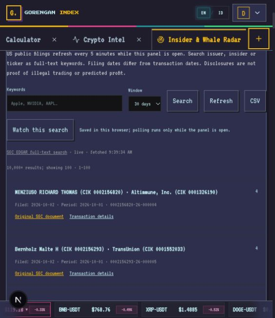
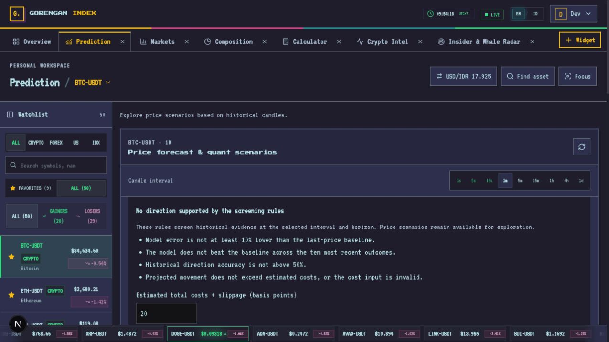

# Verification — 3 October 2026

## Automated checks

- `pnpm test`: 35 passing calculation, parser, cache/cooldown and backend integrity tests.
- `pnpm typecheck`: shared package, market-server and web passed.
- `pnpm lint`: passed.
- `pnpm build`: shared package, standalone market-server and Next.js production build passed.
- `git diff --check`: passed.

Tests cover interval isolation, real rollups, unfinished/future/late observations, no synthesized Yahoo trades, missing-versus-zero values, SEC/XML parsing, CSV formula escaping, deduplication, holdings timezone correctness, ambiguous headline classification, rolling forecast evaluation and provider Retry-After behavior. Fixtures do not enter runtime feeds.

## Live integration

`pnpm smoke:live` completed successfully at 2026-10-03 02:40:30 UTC (09:40:30 Jakarta):

| Observation | Result |
| --- | --- |
| BTC spot aggregate trade sample | 500 events |
| Native one-hour history | 200 bars; each bar has correct duration |
| SEC first page | 100 filings; cached source status preserves fetch time |
| Official IBIT holdings | 803,343.0541 BTC, disclosure date 2026-10-01 |
| Bitcoin transfers ≥5 BTC | 1 transaction in that response's sample |
| RSS | 25 articles |
| Radar sources unavailable | None at this check |
| Binance futures | Funding and OI unavailable; null data and explicit source errors |
| Invalid symbols/intervals | HTTP 400 |
| CSV export | HTTP 200, CSV content type and expected header |

An earlier sample at 09:33 returned four qualifying Bitcoin transactions. Counts reflect changing upstream samples; these values are evidence from a specific run, not constants used by the application. The smoke command's required coverage is SEC search, spot trades, IBIT and history; it does not certify that every optional provider is available.

## Browser checks

Using the Codex in-app browser at `http://localhost:3000/terminal`:

- SEC search for NVIDIA returned ten filings within the selected 30-day window.
- Watch-search action produced a local baseline and `0 unseen filings` status.
- Pagination moved from filings 1–100 to a distinct set at 101–200.
- CSV downloaded from the rendered link; the downloaded file contained 100 data rows and six columns. CSV now uses an ordinary server attachment response; the initial client Blob download did not produce a usable browser automation download event.
- ETF panel showed the official BTC quantity and correct October 1 disclosure date after restart. Session changes use the prior daily close.
- Public News rendered real source links and the BTC filter selected Bitcoin-tagged headlines.
- Prediction interval changed from 1m to 1h and horizon to +20; metrics changed to 46 held-out outcomes, 47.8% direction accuracy, 1.40% MAPE versus 1.15% last-price baseline, and 89.1% observed two-sigma coverage. This sample does **not** show an advantage over the naive baseline.
- Browser console returned no errors in the checked post-restart state. This is a bounded manual smoke test, not exhaustive cross-browser QA.

## Not verified / remaining coverage

- SEC archive XML live retrieval: requires real `SEC_USER_AGENT`; an archive probe returned HTTP 403. Only parsing and explicit failure handling are verified.
- Binance derivatives: provider requests unavailable from this network. Composite signals are withheld when required data is missing.
- QuestDB persistence and catalog database: not connected during the run; the UI works with memory/default instrument catalog, health reports degraded storage. Durability is unverified.
- Automated IDX/OJK ownership ingestion, background alerts, all-ETF flow data, full blockchain indexing, wallet-owner attribution and profitable trading backtests are not implemented.
- Optional Rust service stack, distributed deployments, production OAuth and cross-replica quota coordination are outside the executed checks.

## Follow-up verification: prediction and insider context

The follow-up revision passes 42 tests, typecheck, lint and production build.
Additional tests cover weak/stale/cost-dominated forecast screening, recent
forecast deterioration, missing 10b5-1 flags, derivative and footnote exclusions,
position-row math, filing date context and mismatched XML imports.

Browser checks on live BTC/SEC data:

- The BTC 1m/+10 view withheld a supported direction with explicit baseline,
  recent-performance, direction-accuracy and cost reasons. At that observation:
  93 test outcomes, 44.1% direction accuracy, model MAPE 0.14% versus baseline
  0.12%; recent model MAPE 0.03% versus baseline 0.02%. Values are runtime
  observations, not thresholds or hardcoded outputs.
- Empty cost input kept the screen withheld; the input was restored to 20 bp.
- Selecting the existing NVIDIA saved search restored keywords and its 30-day
  window, and loaded ten original SEC filings with zero unseen entries.
- Local XML analysis was exercised through the browser file picker with an
  explicitly named test-only fixture. It displayed the expected purchase
  classification, $1,000 row value and +10.0% row-position change. The fixture
  was cleared from the UI and removed after the test. This verifies the local
  workflow; it does not verify live SEC XML retrieval or a real NVIDIA purchase.
- Browser console errors were empty in the checked state.

The automatic XML restriction and absence of background monitoring remain as
reported above. New context is available when genuine source XML can be fetched
or supplied locally. The screen passes/fails explicit product rules and does
not certify profitable prediction.

After the follow-up production build, the development web service was restarted.
The live smoke check passed at 09:58:52 Jakarta: 500 spot aggregates, 200 hourly
bars, 100 SEC filings (live), 25 RSS articles, issuer holdings dated October 1,
and five sampled Bitcoin transfers. Funding/OI remained explicitly unavailable.

## IBIT dated activity — 2026-10-03

- `pnpm test`: 46/46 pass, including reported-flow parsing, holdings gaps, issuer correction consistency, concurrent local archiving and restart reads.
- `pnpm typecheck`, `pnpm lint`, production web build and `git diff --check`: pass.
- `pnpm smoke:live`, 2026-10-03 05:32:04 UTC: pass. 30 actual IBIT disclosure rows; latest 2026-10-01 holdings 803,343.0541 BTC versus 801,033.4265 BTC on 2026-09-30. Net BTC change 2,309.6276, provider-derived USD estimate 195,127,674.53. Reported ETF flow remains null because Farside returned HTTP 403. XOOMAR cached successfully and local archive read/write succeeded.
- Live regression checks also obtained 500 spot trades, 200 native hourly candles, 100 SEC filings, 7 sampled mempool transfers and 25 RSS posts. Derivative providers were accessible in this run; availability can change.
- Browser terminal loaded, but attempts to select the ETF tab and obtain the updated DOM repeatedly timed out in the browser CDP control. Visual layout, date-control interaction and downloaded CSV could not be verified through the browser in this run. The API and calculation tests passed; there is no fabricated screenshot proof.
